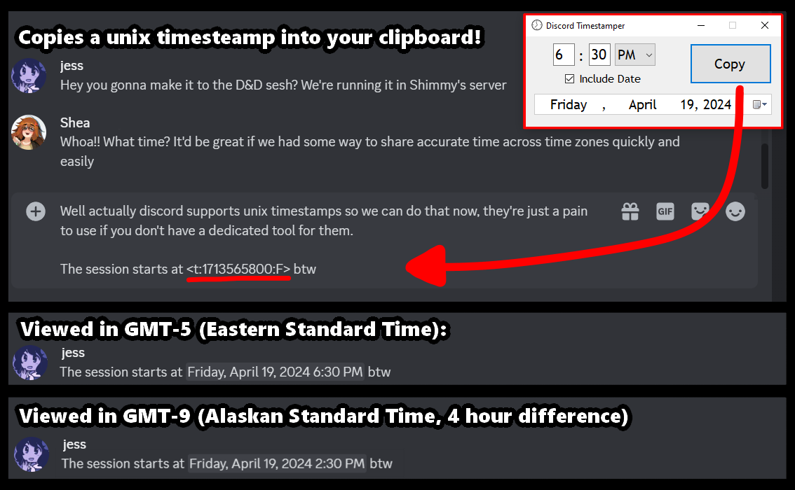

# Discord Timestamper

This Windows application assists in creating unix timestamps for use in Discord. 

 ## To install:

 Download the DiscordTimestamper.exe file located in bin/Debug ([here](https://github.com/deegdumdoodilly/discord-timestamper/blob/main/bin/Debug/DiscordTimestamp.exe)). This is the only file you need.
 
 Consider saving the file in your programs folder, creating a shortcut by pinning it to your Start menu, and [assigning it a shortcut key](https://windows.tips.net/T011721_Assigning_a_Shortcut_Key_to_a_Desktop_Shortcut.html).

 ## To use:

 Upon being launched, the program will automatically set to the current local time on your system. You can edit this time and click "Copy" to copy a [Discord-formatted unix timestamp](https://gist.github.com/LeviSnoot/d9147767abeef2f770e9ddcd91eb85aa) to your keyboard. If "Include Date" is checked, the copy button will give you a timestamp that includes the date, which you can specify in the dropdown.

 ## Q&A:

 ### Why won't this run on my machine?

 I'm not much of a .NET or Windows Forms expert, but reach out to me and I can troubleshoot with you. Contact info in bio. 

### Can you add this feature or bugfix?

Sure, reach out to me. Contact info in bio. 

### Is this secure?

This application only uses two standard Windows functions that access your system: one to get the time, and one to put something in your clipboard. I wrote all this on an outdated version of Visual Studio and I'm not a huge security expert, but I can't imagine this causes any problems on anyone's machine. Have your security friends read through the source code if you don't trust me, it's all here.